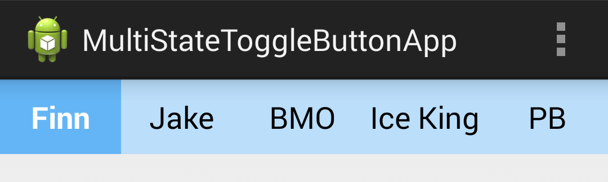

Multi State Toggle Button
=========================

A simple multi-state toggle button for Android forked from jhonora.

I have updated the appearance to match more of a google material design look.



## Usage ##

To use this library you need to clone this repo to your workspace and add the `MultiStateToggleButton` project as a library in your project dependencies.

Then in your activity's XML declare:

```xml
<LinearLayout xmlns:android="http://schemas.android.com/apk/res/android"
    xmlns:tools="http://schemas.android.com/tools"
    android:layout_width="match_parent"
    android:layout_height="match_parent"
    android:orientation="vertical"

	<org.honorato.multistatetogglebutton.MultiStateToggleButton
		android:id="@+id/mstb_multi_id"
		android:layout_width="match_content"
		android:layout_height="wrap_content"
		android:entries="@array/adventuretime_array" />

</LinearLayout>
```

If you need a callback for when the value changes then add this to your code:

```java
MultiStateToggleButton button2 = (MultiStateToggleButton) this.findViewById(R.id.mstb_multi_id);
button2.setOnValueChangedListener(new ToggleButton.OnValueChangedListener() {
	@Override
	public void onValueChanged(int position) {
		Log.d(TAG, "Position: " + position);
	}
});
```

Be sure to declare an array of strings called `adventuretime_array` in your `strings.xml`:

```xml
<string-array name="adventuretime_array">
        <item>Finn</item>
        <item>Jake</item>
        <item>BMO</item>
        <item>Ice King</item>
        <item>PB</item>
    </string-array>
```

The values can also be specified programmatically, plus other options:

```java
MultiStateToggleButton button = (MultiStateToggleButton) this.findViewById(R.id.mstb_multi_id);

// With an array
CharSequence[] texts = new CharSequence[]{"abc", "def"};
button.setElements(texts);

// With a resource id
button.setElements(R.array.planets_array);

// Resource id, position one is selected by default
button.setElements(R.array.dogs_array, 1);
		
// Multiple elements can be selected simultaneously
button.enableMultipleChoice(true);
```
